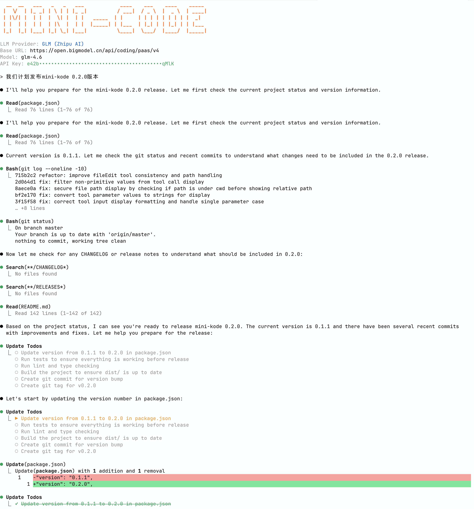

# Mini-Kode

An educational AI coding assistant project that helps you understand and hack modern AI coding assistant systems.

## 🌟 Why Mini-Kode?



Mini-Kode is an **educational project** designed to help developers understand modern Coding Agent architecture. We strike the perfect balance between overly complex open-source projects and simplistic demo examples, offering a complete yet manageable implementation (14K lines of production code) with:

- **📚 Education-First Design** - Clean architecture built on OpenAI SDK with thoughtful type design and comprehensive comments
- **🛠️ Complete Tool System** - Unified interface with comprehensive tools for file operations, search, and command execution
- **🔌 MCP Integration** - Connect to external MCP servers for extended functionality
- **⚙️ Multi-LLM Support** - Compatible with OpenAI APIs, including GLM, DeepSeek, and other mainstream models
- **🤖 Agent Loop** - Complete LLM workflow with streaming responses and human-in-the-loop permission approval
- **🎨 Modern UI** - React/Ink-based terminal interface with theme support

## 🚀 Quick Start (Install & Use)

### Install Globally

```bash
npm install -g mini-kode
```

### Set Up API Key

**Recommended: DeepSeek** (tested and verified):

```bash
export DEEPSEEK_API_KEY="your-deepseek-api-key"
```

**Or use OpenAI compatible API**:

```bash
export OPENAI_API_KEY="your-openai-api-key"
# or
MINIKODE_API_KEY="your-api-key"
MINIKODE_BASE_URL="https://your-api-provider.com/v1"
MINIKODE_MODEL="your-model-name"
```

### Run Mini-Kode

```bash
# Interactive mode (launch UI)
mini-kode

# Non-interactive mode (direct execution)
mini-kode "help me fix the bug in auth.ts"
```

## 🔧 Development Quick Start

### Prerequisites

- **Bun**
- **pnpm**

### Install Dependencies

```bash
pnpm install
```

### Development Commands

```bash
# Development mode with file watching
pnpm run dev

# Build
pnpm run build

# Test
pnpm run test
```

## 📖 Learning Resources

Want to dive deeper into the system architecture? Check out [docs/README.md](./docs/README.md) for complete system documentation and architecture explanations.

## 🧠 Project Memory

Mini-Kode automatically uses `AGENTS.md` file in your project root to provide context-aware assistance:

- **Automatic Context**: System reads `AGENTS.md` to understand your project
- **Customizable**: Edit `AGENTS.md` to include project-specific information
- **Persistent Memory**: Maintains project context across sessions

## 📊 Project Scale

- **~130 files** in the source code
- **~14K lines** of production code
- **~11K lines** of actual implementation logic

This project provides a comprehensive yet manageable codebase for understanding modern AI assistant architecture - **your first Coding Agent, and your learning companion**.

## 🏗️ Project Structure

```
src/
├── tools/          # Tool system and individual tools
├── ui/             # Ink-based CLI interface components
├── llm/            # LLM client and streaming integration
├── permissions/    # Two-layer permission system
├── config/         # Configuration management
├── cli/            # CLI framework and commands
├── agent/          # Core agent logic
├── sessions/       # Session management
└── utils/          # Shared utilities
```

## 🛠️ Tech Stack

- **TypeScript** - Static type checking
- **pnpm** - Package management
- **Ink** - React terminal UI
- **OpenAI SDK** - LLM integration (supports DeepSeek/OpenAI/compatible APIs)
- **Vitest** - Testing framework
- **Zod** - Runtime type validation
- **Commander** - CLI framework

## 🚧 Future Plans

1. **Session Persistence and Resume** - Save and restore agent sessions
2. **LLM Built-in Tool Integration** - Support for LLM's native tool capabilities (note: DeepSeek currently doesn't support web search tools)
3. **Image Input Support** - Process and analyze image inputs
4. **Sub Agents Functionality** - Hierarchical agent delegation
5. **Reasoning Model Support** - Integration with reasoning-focused models
6. **Tool Call Message Streaming** - Real-time streaming of tool execution
7. **Context Caching** - Smart caching of conversation context to reduce token usage

## 📚 References

This project was inspired by and references the following resources:

- **[Building an Agent](https://ampcode.com/how-to-build-an-agent)** - Guide on building AI agents
- **[Building an Agentic System](https://gerred.github.io/building-an-agentic-system/index.html)** - Comprehensive guide to building agentic systems
- **[System and Tool Prompts](https://gist.github.com/transitive-bullshit/487c9cb52c75a9701d312334ed53b20c)** - System prompts and tool prompts for coding agent
- **[Neovate Code](https://github.com/neovateai/neovate-code)** - Todo tool prompt
- **[Claude Code](https://claude.ai/code)** - UX reference for CLI interface design
